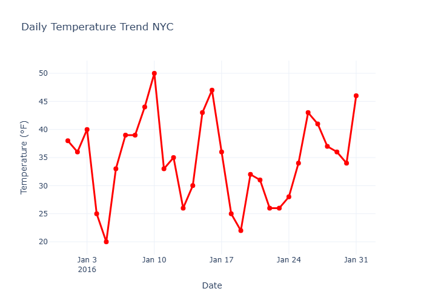
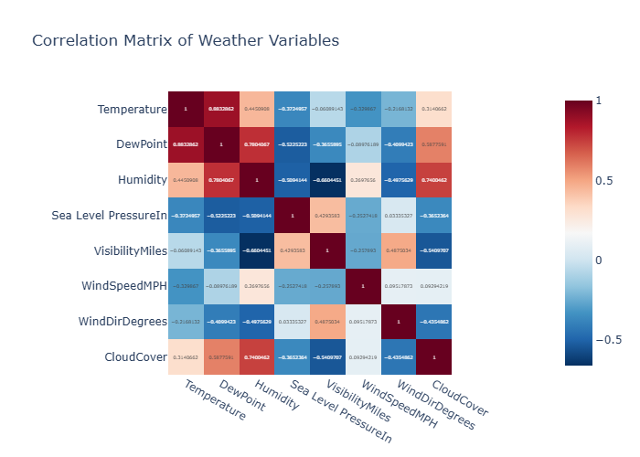

# 31-Day NYC Weather Analysis

> **Cleaning data is not a preliminary task—it is the analysis that makes every subsequent insight trustworthy.**

This project presents an end-to-end exploratory analysis of a 31-day New York City weather dataset using Python, Pandas, and Plotly Express. The analysis covers data cleaning, quality assessment, exploratory data analysis (EDA), statistical summaries, relationship analysis, and interactive visualizations to uncover meaningful weather patterns.

Beyond creating visualizations, the notebook demonstrates a disciplined analytical workflow that mirrors how real-world datasets are prepared before business decisions are made.


# Project Context

Raw datasets are rarely ready for analysis. Missing values, inconsistent entries, incorrect data types, and duplicate records can all lead to misleading conclusions if left untreated.

The purpose of this project is to demonstrate a practical workflow for transforming raw weather observations into a reliable dataset suitable for exploration, statistical analysis, and visualisation.


# Dataset

**Source:** New York City Weather Dataset

**Observation Period:** 31 Days

**Format:** CSV

The dataset contains daily weather observations including:

- Temperature
- Dew Point
- Relative Humidity
- Sea Level Pressure
- Wind Speed
- Visibility
- Precipitation
- Weather Events


# Tools Used

| Tool | Role |
|------|------|
| Python | Programming Language |
| Pandas | Data Cleaning & Analysis |
| Plotly Express | Interactive Visualisations |
| Jupyter Notebook | Development Environment |


# Project Workflow

## Data Import

The dataset is imported from a CSV file using a reusable Python function with basic exception handling to improve reliability and code reusability.


## Data Understanding

Before making any changes, the dataset is explored to understand its structure and overall quality.

The dataset is evaluated by examining:

- Dataset dimensions
- Sample records
- Column names
- Data types
- Missing values
- Duplicate records
- Descriptive statistics

This initial exploration provides a clear understanding of the condition of the dataset before preprocessing begins.


## Data Cleaning

To prepare the dataset for meaningful analysis, several cleaning operations are performed.

These include:

- Identifying missing values
- Detecting duplicate records
- Replacing trace precipitation values (`T`)
- Filling missing observations where appropriate
- Converting variables into appropriate data types
- Reorganising columns into a cleaner structure

These steps improve consistency and analytical reliability.


## Exploratory Data Analysis

After cleaning, the cleaned dataset is explored to examine:

- Temperature
- Dew Point
- Relative Humidity
- Sea Level Pressure
- Wind Speed

Summary statistics are generated to understand the distribution, spread, and central tendency of each variable.


## Correlation Analysis

The project examines relationships between numerical weather variables using correlation analysis to identify patterns and measure the strength of associations within the dataset.


## Interactive Visualisation

The project concludes with interactive visualizations developed using Plotly Express, making trends and relationships easier to interpret.


# Skills Demonstrated

- Import external datasets into Python.
- Assess data quality before analysis.
- Clean and prepare real-world data.
- Explore datasets using descriptive statistics.
- Analyse weather variables individually.
- Investigate relationships between variables.
- Build interactive visualisations.
- Apply a structured exploratory data analysis workflow.


# Repository Structure

```text
nyc-weather-analysis/
│
├── nyc_weather.csv
├── nyc-weather-analysis.ipynb
├── README.md
└── images/
    ├── temperature-analysis.png
    └── correlation-heatmap.png
```


# Project Preview

## Temperature Analysis




## Correlation Heatmap




# Key Insights

- The average temperature over the 31-day period was **34.68°F**, with temperatures ranging from **20°F** to **50°F**, indicating considerable day-to-day variation during the month.

- **Temperature** and **Dew Point** showed a **strong positive correlation (0.88)**, suggesting that warmer days generally coincided with higher moisture levels in the air.

- **Humidity** and **Visibility** exhibited a **moderately strong negative correlation (-0.66)**, indicating that higher humidity was often associated with reduced visibility.

- The dataset required preprocessing before analysis, including handling missing values, replacing trace precipitation values, and correcting data types, highlighting the importance of data quality in analytical workflows.

- Interactive visualizations made it easier to identify weather trends and relationships that would have been less apparent from summary statistics alone.


## Author

**Nneoma Nwachukwu**

Aspiring Data Analyst with interests in Python, SQL, data visualization, and business analytics.

GitHub: @nneomanwachukwu
